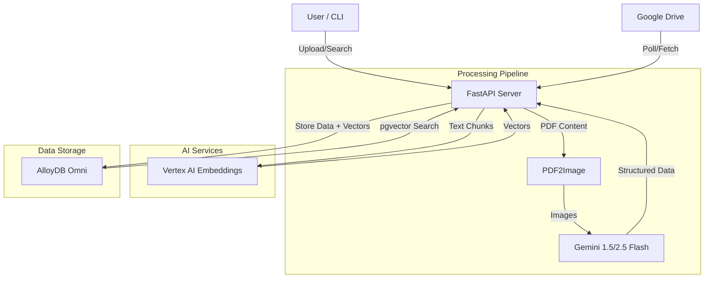

# System Architecture

## 1. High-Level Overview
The PDF2AlloyDB system automates the ingestion of PDF documents (sewing instructions), extracts structured information using multimodal AI, and enables high-performance semantic search using vector embeddings in AlloyDB.

## 2. Architecture Diagram

## 3. Core Components

### 3.1 Client Layer
- **CLI Tool (`client/cli.py`)**: A Typer-based command-line interface for administrators to trigger batch processing, searching, and system management.
- **Python Client (`client/api_client.py`)**: A wrapper around the REST API for programmatic access.

### 3.2 Application Server
- **FastAPI (`app/main.py`)**: The core application server handling HTTP requests.
- **Services**:
  - `DriveService`: Manages interaction with Google Drive API.
  - `PDFService`: Handles PDF downloading and conversion to images.
  - `AlloyDBService`: Manages database connections and vector operations.
- **Pydantic Models**: Defines the data validation and schema for inputs/outputs.

### 3.3 Database Layer
- **AlloyDB Omni**: PostgreSQL-compatible database running locally or in cloud.
- **Extensions**:
  - `vector`: Defines the `vector` data type and distance metrics (cosine similarity).
  - `google_ml_integration`: (Optional in local Omni, used in cloud) for direct model invocation.
- **Schema**:
  - `documents`: Stores document-level metadata and combined text embedding.
  - `instructions`: Stores individual step-level data, bounding boxes, and embeddings.

### 3.4 AI & ML Services
- **Gemini (via `google-genai`)**: Multimodal LLM responsible for "looking" at the PDF pages and extracting JSON-structured data (text, bounding boxes).
- **Vertex AI (Embeddings)**: Generates 768-dimensional vectors (using `text-embedding-004`) for the extracted text to enable semantic search.

## 4. Data Flow

1.  **Ingestion**: User uploads a file or system polls Google Drive.
2.  **Preprocessing**: PDF is converted to a series of images.
3.  **Extraction**: Images are sent to Gemini with a prompt to extract sewing instructions, headers, and bounding boxes.
4.  **Embedding**: Extracted text (summaries and individual steps) is sent to Vertex AI to generate vector embeddings.
5.  **Storage**: Structured data and embeddings are transactionally saved to AlloyDB.
6.  **Retrieval**: User queries are embedded using the same model, and a vector similarity search (`<=>` operator) is performed in AlloyDB to find relevant documents or steps.
